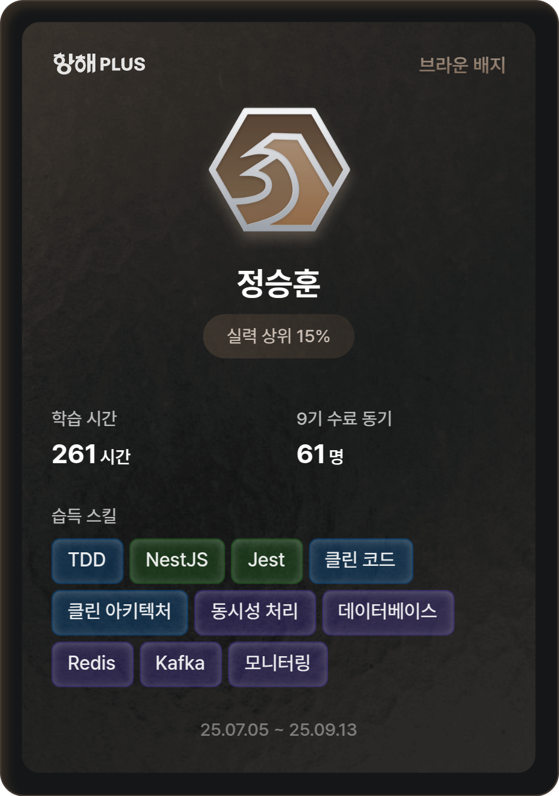

 

<h2>🛠️ Tech Stack</h2>
<table style="border: none;">
  <thead>
    <tr>
      <th style="border: none; text-align: left;">💻 Frontend</th>
      <th style="border: none; text-align: left;">🔧 Backend</th>
      <th style="border: none; text-align: left;">🗄️ Database</th>
      <th style="border: none; text-align: left;">🛠️ Tools & DevOps</th>
    </tr>
  </thead>
  <tbody>
    <tr>
      <td style="border: none;">
        

        

        

      </td>
      <td style="border: none;">
        

        

        

 
      </td>
      <td style="border: none;">
        

        

        

      </td>
      <td style="border: none;">
        

        

        

        

      </td>
    </tr>
  </tbody>
</table>

<!--  |  -->

---------------------------------------------------------------------------------------------

 

